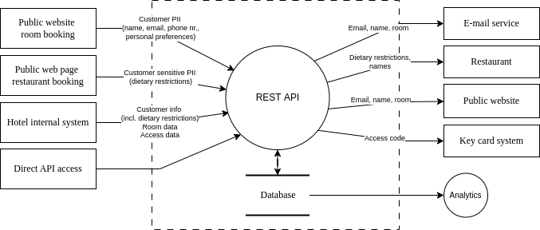

# Threat Modeling 'Hotel Very Nice Spa' 

|                                 |                         |
|---------------------------------|-------------------------|
| **Service Owner(s)**            | Backend Team            |
| **Risk owner**                  | Even Bruvik Frøyen      |
| **Service Data Classification** | `STRICTLY CONFIDENTIAL` |

## Service description (2-5 min)
The backend of the 'Hotel Very Nice Spa' application, which handles key card accesses, room bookings, and restaurant reservations. 

## Data-flow diagram (2 min)
_A **simple** illustration, e.g. a data-flow diagram to make it easy to see how the data flows in the application. 
Include this diagram beforehand to help participants understand data flow during the activity._

## Data dictionary (5-10 min)

Instructions

1. List the **processed** or **stored** data types. Group similar data types to keep the list concise and manageable.
2. Classify the data according to the organization's **data classification** policy.
3. Set the `Service Data Classification` value in the table at the top of this document to the highest classification in this data dictionary. _**Note!** All services has access tokens, these are expected to be stored in a secret management tool such as Azure Key Vault and does not need to be part of the data dictionary._

Any changes to the data? Remember to update the list!

`PUBLIC` `INTERNAL` `CONFIDENTIAL` `STRICTLY CONFIDENTIAL`

| Data type              | Classification          | Comments            |
|------------------------|-------------------------|---------------------|
| Customer PII           | `CONFIDENTIAL`          |                     |
| Dietary restrictions   | `STRICTLY CONFIDENTIAL` | Encrypted in the DB |
| Employee personal data | `INTERNAL`              |                     |
| Room data              | `INTERNAL`              |                     |
| Key Card access codes  | `CONFIDENTIAL`          |                     |

## Threat scenarios (10-30 min)

Instructions

Identify realistic scenarios that could affect **confidentiality**, **integrity** and **availability**. 

1. (10-25 min) Start by filling the **Threat scenario**, **Driver** and **Assessment** columns. Refrain from discussing solutions (no time!).
2. When you are done, if you have time, create issues for scenarios in your issue management system and add their link in the **Preventive measures** column. 

| Threat scenario | Driver | Assessment | Preventive measures |
| ----------------|-------------|------------|---------------------|
| | _Why the scenario is considered important or concerning. An advice is to think "I am worried that..."_ | _Consider the worst-case scenario if no controls are implemented_ | _Issues in your issue management system_ | |
| An attacker gets hold of the access codes and enters rooms they are unauthorized to enter | We are not sure whether forged key cards can be used on the doors. If we don't secure the access codes well enough, our service can be part of a forging process. | Worst case, people can get hurt and/or the hotel gets bad reputation and media coverage. | See [Jira issue #1337](some.link) |
| A vulnerability in a third-party library used by the application is exploited, leading to unauthorized access to sensitive data | We are lacking proper third-party dependency management | Data breaches, loss of customer trust, and potentially regulatory fines | See [Jira issue #4141]() |

## Follow-up actions (2 min) 
* Schedule the next meeting. Evaluate whether there was adequate time for discussion and schedule the next regular meeting accordingly. _Not sure? Choose some time between 3-6 months._
* Create issues for the preventive measures
* Prioritize the issues

---

We always want to improve this activity. Contact the Application Security team or your Security Champion to share feedback.
