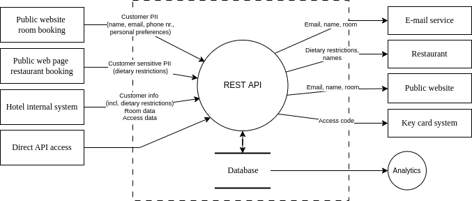

# Rapid Risk Assessment (Threat Modeling)

|                                 |                         |
|---------------------------------|-------------------------|
| **Service Owner(s)**            | Backend Team            |
| **Risk owner**                  | Even Bruvik Frøyen      |
| **Service Data Classification** | `STRICTLY CONFIDENTIAL` |

## Service description (2-5 min)
The backend of the A Very Nice Spa-application. It handles key card management, accesses, e.g. to the spa or swimming pool, as well as room booking and restaurant booking. 

## Data-flow diagram (2 min)
_A **simple** illustration, e.g. a data-flow diagram to make it easy to see how the data flows in the application. 
Add this another time, not during the process._

## Data dictionary (5-10 min)

Instructions

1. List the **processed** or **stored** data types. Make the list small by grouping data.
2. Classify the data according to the organization's **data classification** policy.
3. Set the `Service Data Classification` value in the table at the top of this document to the highest classification in this data dictionary. _**Note!** All services has access tokens, these are expected to be stored in a secret management tool such as Azure Key Vault and does not need to be part of the data dictionary._

Any changes? Remember to update the list!

`PUBLIC` `INTERNAL` `CONFIDENTIAL` `STRICTLY CONFIDENTIAL`

| Data type              | Classification          | Comments            |
|------------------------|-------------------------|---------------------|
| Customer PII           | `CONFIDENTIAL`          |                     |
| Dietary restrictions   | `STRICTLY CONFIDENTIAL` | Encrypted in the DB |
| Employee personal data | `INTERNAL`              |                     |
| Room data              | `INTERNAL`              |                     |
| Key Card access codes  | `CONFIDENTIAL`          |                     |

## Threat scenarios (10-30 min)

Instructions

Find appropriate scenarios affecting **confidentiality**, **integrity** and **availability**. Make sure to keep it realistic, _an EMP bomb might not be in scope_. 

1. (10-25 min) Start by filling the **Threat scenario**, **Risk driver** and **Assessment** columns.
2. When you are done, if you have time, create issues for scenarios in your issue management system and add their link in the **Preventive measures** column. 

| Threat scenario | Risk driver | Assessment | Preventive measures |
| ----------------|-------------|------------|---------------------|
| | _An advice is to think "I am worried that..."_ | _What's the worst that may happen if controls aren't implemented?_ | _Create an issue for each task, **do not** find or discuss solutions here (no time!)_ | |
| An attacker gets hold of the access codes and enters rooms they are unauthorized to enter | We are not sure whether forged key cards can be used on the doors | In the worst case, people can get hurt, or the hotel gets bad reputation and media coverage. This _This is not really this app's issue, however, our level of secure storage affects the risk level._ | See [Jira issue #1337](some.link) |

## Concluding (2 min) 
Agree on who does these actions: 

* Schedule the next meeting. Was there too little time to discuss? Don't wait to long until next time. Otherwise, it can be a good idea to schedule it in approximately 3-6 months.
* Create tickets for the issues
* Prioritise the issues

